# Smart City Traffic Pipeline
*Projet de Synthèse - Big Data Processing*

Ce projet implémente un pipeline Big Data complet pour la collecte, le traitement et l'analyse de données de trafic urbain en temps réel. Il répond à la problématique de la gestion intelligente de la mobilité dans une Smart City.

---

## 📚 Table des Matières
1. [Introduction & Contexte](#1-introduction--contexte)
2. [Architecture Technique](#2-architecture-technique)
3. [Installation & Démarrage (Quick Start)](#3-installation--démarrage-quick-start)
4. [Rapport de Projet Détaillé](#4-rapport-de-projet-détaillé)
    - [Étape 1 : Collecte des Données](#étape-1--collecte-des-données-data-collection)
    - [Étape 2 : Ingestion (Kafka)](#étape-2--ingestion-des-données-data-ingestion)
    - [Étape 3 : Data Lake (HDFS)](#étape-3--stockage-des-données-brutes-data-lake--raw-zone)
    - [Étape 4 : Traitement (Spark)](#étape-4--traitement-des-données-data-processing)
    - [Étape 5 : Zone Analytique](#étape-5--structuration-analytique-analytics-zone)
    - [Étape 6 : Visualisation (Grafana)](#étape-6--exploitation-et-visualisation)
    - [Étape 7 : Orchestration (Airflow)](#étape-7--orchestration-du-pipeline)

---

## 1. Introduction & Contexte
Dans le cadre des **Smart Cities**, la surveillance du trafic est cruciale. Ce projet vise à :
- Surveiller l'état du trafic en temps réel (Vitesse, Densité).
- Détecter les congestions automatiquement.
- Stocker et historiser les données pour analyse future.

**Problématique :** *Comment concevoir et implémenter un pipeline Big Data capable de collecter des données de trafic urbain en temps réel, de les stocker, de les traiter et de produire des indicateurs exploitables ?*

---

## 2. Architecture Technique
Le projet repose sur une stack moderne et conteneurisée :

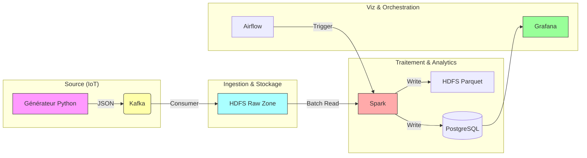

- **Langage** : Python 3.9
- **Message Broker** : Apache Kafka (Confluent Image)
- **Data Lake** : Hadoop HDFS (Namenode/Datanode)
- **Processing** : Apache Spark 3.5 (Master/Worker)
- **Orchestration** : Apache Airflow 2.6
- **Visualisation** : Grafana + PostgreSQL

---

## 3. Installation & Démarrage (Quick Start)

### Prérequis
- Docker Desktop installé et fonctionnel.
- Git.

### Lancement Rapide
1. **Démarrer l'infrastructure**
   La commande suivante construit les images personnalisées et lance les 10+ conteneurs :
   ```bash
   docker-compose up -d --build
   ```
   > **Capture : Validation du Démarrage**
   > 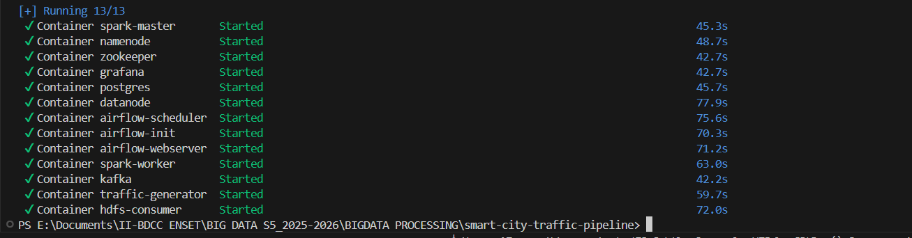

2. **Vérifier l'état des services**
   Tous les conteneurs doivent être au statut "Running" (Vert).
   > **Capture : Vue Docker Desktop**
   > 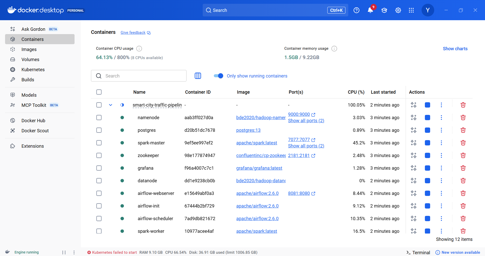

### Accès aux Interfaces
| Service | URL | Identifiants |
|---------|-----|--------------|
| **Kafka** | `localhost:9092` | (TCP) |
| **HDFS WebUI** | [http://localhost:9870](http://localhost:9870) | - |
| **Spark Master** | [http://localhost:8080](http://localhost:8080) | - |
| **Airflow** | [http://localhost:8081](http://localhost:8081) | `admin` / `admin` |
| **Grafana** | [http://localhost:3000](http://localhost:3000) | `admin` / `admin` |

---

## 4. Rapport de Projet Détaillé

### Étape 1 — Collecte des Données (Data Collection)
Nous simulons un réseau de capteurs IoT urbains grâce au script `traffic_generator.py`.
- **Mécanisme** : Le script génère des événements aléatoires réalistes basés sur une liste de capteurs (lat/lon) définie en dur.
- **Logique** : 
    - Simulation des heures de pointe (Vitesse réduite, densité élevée).
    - Format JSON standardisé.
- **Exemple de Donnée JSON (Conforme au Sujet)** :
  ```json
  {
    "sensor_id": "S-001",
    "road_id": "R-001",
    "road_type": "autoroute",
    "zone": "Secteur-Nord",
    "vehicle_count": 85,
    "average_speed": 42.15,
    "occupancy_rate": 65.2,
    "event_time": "2024-01-04T10:00:00",
    "location": {"lat": 48.8566, "lon": 2.3522}
  }
  ```

### Étape 2 — Ingestion des données (Data Ingestion)
L'ingestion se fait en **Streaming** via Apache Kafka.
- **Topic** : `traffic-events`
- **Partitionnement** : Kafka gère la distribution. Dans notre cluster simple nœud, nous utilisons 1 partition par défaut pour garantir l'ordre séquentiel.
- **Volume & Fréquence** : Le générateur envoie environ 1 événement par seconde par capteur, ce qui permet de simuler un flux continu ("Unbounded Stream") sans saturer le disque local de développement.
- **Rôle de Kafka** : Agit comme un tampon (buffer) robuste. Si HDFS est lent ou indisponible, Kafka conserve les messages (Retention Policy).

### Étape 3 — Stockage des données brutes (Data Lake – Raw Zone)
Les données sont déversées dans **HDFS** dans la zone "Raw".
- **Composant** : Script `consumer_to_hdfs.py`.
- **Structure** : `/data/raw/traffic/date=YYYY-MM-DD/zone=NOM_ZONE/`
- **Justification** : Le double partitionnement (Date + Zone) est essentiel pour optimiser les requêtes analytiques de la municipalité qui travaille souvent par secteur géographique.

> **Preuve de Stockage (WebHDFS)** :
> 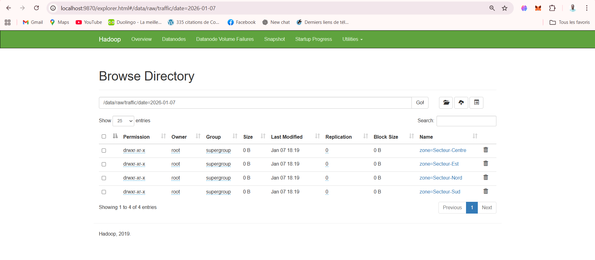

### Étape 4 — Traitement des données (Data Processing)
Le traitement est un job Batch exécuté périodiquement par **Apache Spark**.
- **Lancement** :
  ```powershell
  # IMPORTANT : Donner les droits d'écriture à Spark avant le premier lancement
  docker exec namenode hdfs dfs -chmod -R 777 /data

  # Execution du job
  docker exec spark-master /opt/spark/bin/spark-submit --master spark://spark-master:7077 --jars /opt/spark/jars/postgresql-42.2.18.jar /opt/spark-apps/traffic_processing.py
  ```
- **Opérations** :
  1. Lecture des fichiers JSON depuis HDFS Raw Zone.
  2. Typage correct des données (Timestamp, Double).
  3. **Calculs (Conformes au Sujet)** :
     - **Trafic moyen par zone** (Secteur-Nord, Centre, etc.)
     - **Vitesse moyenne par route** (`road_id`)
     - **Taux de congestion** basé sur l'occupation.
  4. Les données transformées sont archivées et envoyées vers la Serving Layer.

> **Validation du Job Spark (Master UI)** :
> 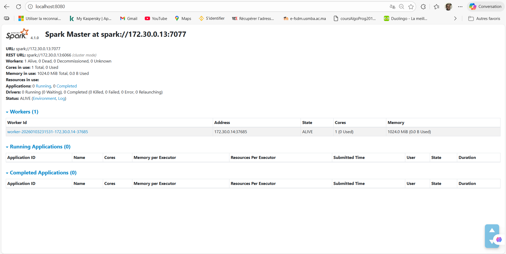


### Étape 5 — Structuration analytique (Analytics Zone)
Les résultats raffinés sont stockés dans deux destinations complémentaires :

1. **HDFS (Format Parquet)** : `/data/analytics/traffic`
   - **Justification** : Le format Parquet est colonnaire et supporte la compression Snappy. Il est 10x plus rapide à lire pour les requêtes analytiques que le JSON ou CSV.

   > **Preuve de Stockage (WebHDFS Analytics)** :
   > 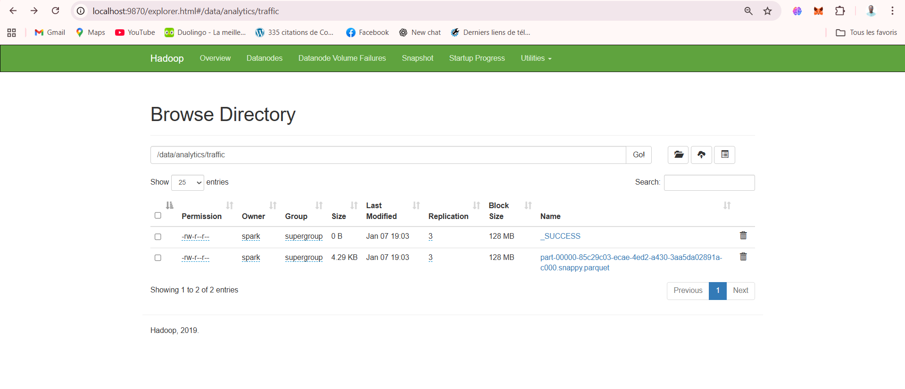

2. **PostgreSQL (Serving Layer)** : Tables `traffic_stats_zone` et `traffic_stats_road`
   - **Justification** : Permet une interrogation SQL rapide (latence < 100ms) pour servir les tableaux de bord en temps réel.
  ```powershell
  docker exec postgres psql -U airflow -d airflow -c "SELECT zone, window_start, avg_traffic, avg_speed, status FROM traffic_stats_zone ORDER BY window_start DESC LIMIT 10;"
  ```
  
   > **Données Agregées dans Postgres** :
   > 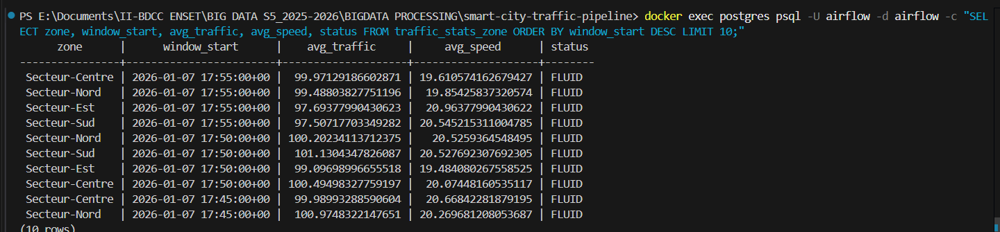

### Étape 6 — Exploitation et visualisation
**Grafana** (Port `3000`) est connecté à la base PostgreSQL pour afficher les KPIs de mobilité.

#### 1. Configuration de la Source de Données (PostgreSQL)
- **Host** : `postgres:5432`
- **Database** : `airflow`
- **User** : `airflow`
- **Password** : `airflow`
- **SSL Mode** : `disable`

> **Preuve de Configuration Source** :
> 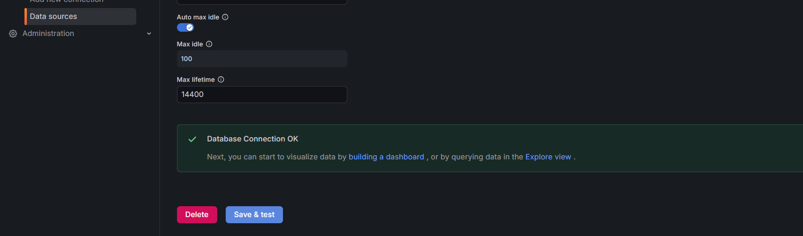

#### 2. Création du Dashboard (Panels)
Pour chaque graphique, cliquez sur **Add** -> **Visualization**, sélectionnez la source Postgres et entrez :

- **Évolution du trafic par zone** (Type: *Time Series*) :
  ```sql
  SELECT window_start as time, avg_traffic as value, zone FROM traffic_stats_zone ORDER BY 1;
  ```
- **Vitesse moyenne par route** (Type: *Bar chart*) :
  ```sql
  SELECT road_id, road_avg_speed FROM traffic_stats_road;
  ```
- **Zones qui sont fluide ** (Type: *Table*) :
  ```sql
  SELECT zone, status FROM traffic_stats_zone WHERE status = 'FLUID';
  ```

> **Tableau de Bord Final (Vue d'ensemble)** :
> 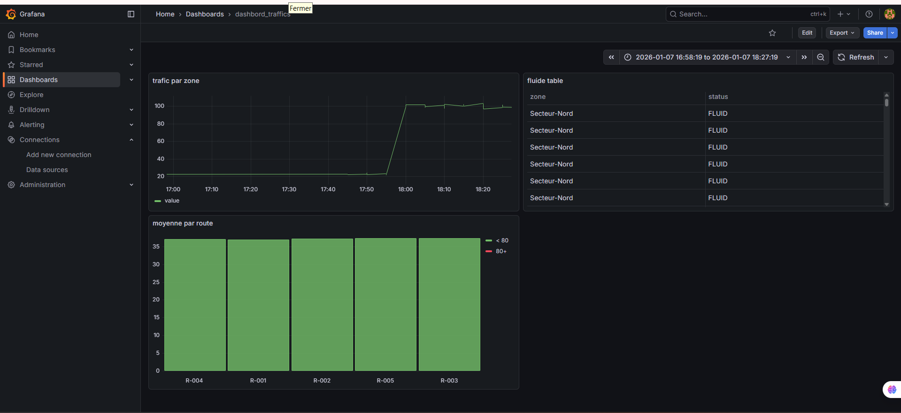

### Étape 7 — Orchestration du pipeline
**Apache Airflow** (Port `8081`) automatise l'ensemble du flux de traitement. Sans orchestration, le pipeline nécessiterait une intervention humaine constante pour chaque nouveau fichier stocké.

#### 1. Accès et Configuration
- **Accès UI** : `http://localhost:8081` (Admin / Admin)
- **Configuration de la Connexion Spark** (Crucial pour l'automatisation) :
  1. Allez dans **Admin** > **Connections**.
  2. Cliquez sur **+** (Add record).
  3. **Conn Id** : `spark_default`
  4. **Conn Type** : `Spark`
  5. **Host** : `spark://spark-master`
  6. **Port** : `7077`
  7. **Save**.

> **Preuve de Configuration de la Connexion Spark** :
> 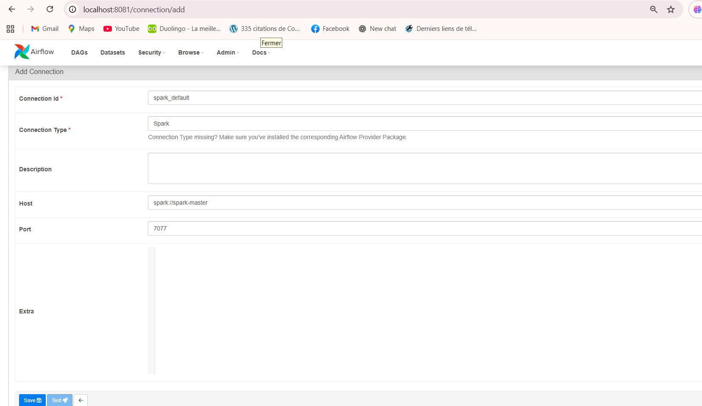

#### 2. Fonctionnement du DAG
- **DAG** : `traffic_pipeline_dag`
- **Fréquence** : `*/5 * * * *` (Toutes les 5 minutes).
- **Justification** : Airflow assure la **robustesse**. Si le job Spark échoue (ex: problème réseau), Airflow le détecte, envoie une alerte et tente de le relancer automatiquement selon les `retries` configurés.

> **Supervision du Workflow (Airflow Grid)** :
> 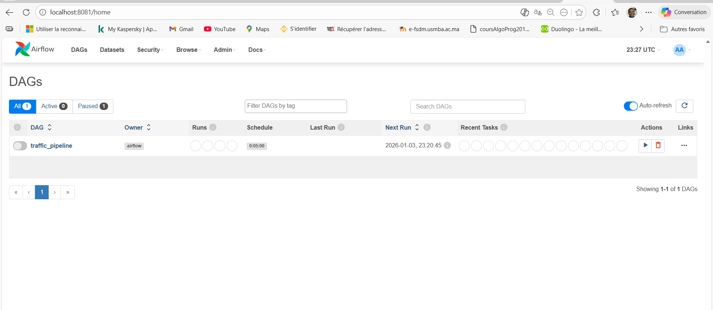

---

## 5. Conclusion & Enseignements

### Architecture Lambda Implémentée
Ce projet démontre la mise en œuvre d'une **Architecture Lambda** simplifiée, permettant de concilier la précision du traitement batch avec la réactivité nécessaire au monitoring urbain :
- **Batch Layer** : Stockage complet dans HDFS et traitement lourd via Spark pour garantir une "source de vérité" historique.
- **Speed Layer** : Ingestion streaming via Kafka permettant de capturer les événements à la milliseconde.
- **Serving Layer** : PostgreSQL agit comme zone de service ultra-rapide pour Grafana, évitant les latences de lecture directe sur le Data Lake.

### Enseignements Clés
- **Maîtrise de l'écosystème Big Data** : Intégration de composants hétérogènes (Hadoop, Spark, Kafka, Airflow) via Docker.
- **Optimisation du Stockage** : Compréhension de l'importance du partitionnement par date et de l'efficacité du format colonnaire (**Parquet**) pour les analyses analytiques.
- **Orchestration et Supervision** : Mise en place d'Airflow pour automatiser un pipeline complexe, assurant la robustesse et la visibilité sur les échecs éventuels.
- **Serving Layer** : Justification de l'utilisation d'une base relationnelle (**PostgreSQL**) en complément du Data Lake pour offrir une latence minimale aux outils de visualisation comme **Grafana**.
